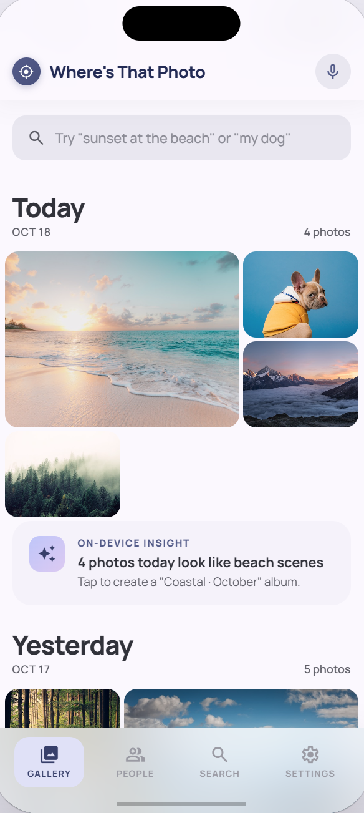
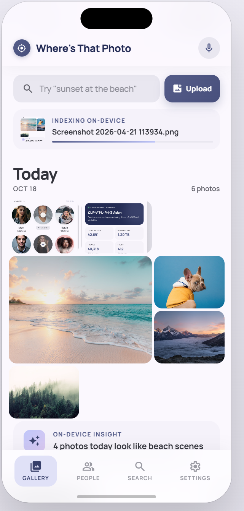
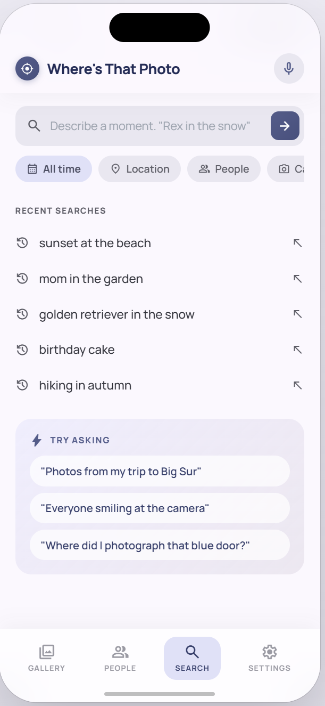
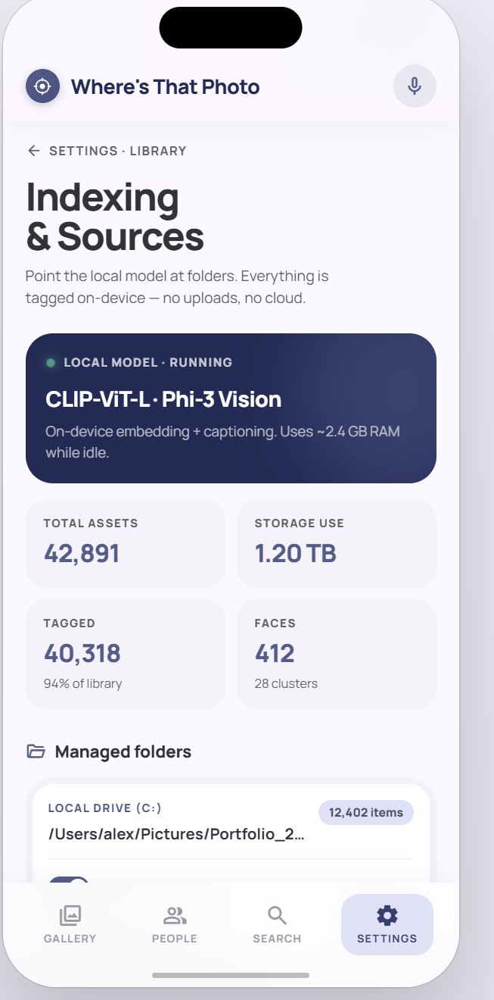

<div align="center">

# 📷 Where's That Photo

**Find any photo by describing it — entirely on your phone.**

[](https://kotlinlang.org/)
[](https://developer.android.com/)
[](https://developer.android.com/jetpack/compose)
[](#license)

Search your photo library the way you'd describe a memory — *"the café in Paris"*, *"graduation with grandma"*, *"that sunset hike"*, *"Tokyo, last October"* — with no cloud, no API key, and no photo ever leaving your device.

</div>

---

## How it works

Where's That Photo combines three on-device models to understand both your photos and your words:

| Stage | Model | What it does |
|---|---|---|
| **Vision** | MobileCLIP (ONNX) | Embeds each photo into a 512-d semantic space |
| **Metadata** | Android ExifInterface + Geocoder | Reads date, time, and GPS from each photo; reverse-geocodes to a place name |
| **Caption** | Gemma 3n E4B (MediaPipe) | Writes a 2–3 sentence description grounded in the image and its EXIF metadata |
| **Language** | MiniLM (ONNX) | Embeds captions and queries into a 384-d space for phrase-level matching |
| **Search** | Fused scoring + Gemma reranking | CLIP and caption similarity combined; Gemma resolves synonym gaps |

Every model runs locally. Your photos stay on your phone.

---

## Features

- **Natural language search** — query by scene, mood, subject, occasion, date, or place
- **New app shell UI** — bottom navigation with dedicated `Gallery`, `People`, and `Search` experiences
- **Gallery home feed** — recency-grouped layout (`Today`, `Yesterday`, `This Week`, `This Month`, `Earlier`) with dynamic counts
- **Upload-to-index flow** — selecting photos from Upload immediately starts on-device indexing
- **Live indexing indicator** — compact progress card with thumbnail, current file name, and progress bar
- **People & Pets view** — clustered-style circular identity cards (known + unknown placeholders) in a dedicated screen
- **Search workspace** — query composer, filter chips, recent searches, and prompt suggestions in one screen
- **EXIF + geolocation aware** — date/time and GPS metadata are extracted; valid coordinates are persisted to SQLite and reverse-geocoded into caption context, enabling queries like *"Seattle pictures"*
- **Synonym-aware** — searches for "deity" find photos captioned "god"; "canine" finds "dog"
- **Two-signal ranking** — CLIP handles visual semantics; MiniLM handles phrasing; scores are fused for precision
- **Gemma fallback reranking** — when vector similarity is ambiguous, Gemma judges caption relevance in a single batched call
- **Fully private** — all inference and geocoding run on-device; no photo or query leaves your phone

---

## Screenshots

| Gallery | Gallery (while indexing) |
|---|---|
|  |  |

| People & Pets | Search | Settings |
|---|---|---|
|  |  |  |

---

## Get started

### Requirements

| | |
|---|---|
| Android | 12+ (API 31), physical device recommended |
| RAM | 4 GB+ free (Gemma loads ~3 GB) |
| JDK | 17 |
| Tools | Android Studio Hedgehog+, `adb` |

### 1. Clone and sync

```bash
git clone https://github.com/srinivasrk/wheres-that-photo.git
cd wheres-that-photo
# Open in Android Studio and let Gradle sync
```

### 2. Download model weights

Weights are not stored in this repo. Fetch them with the [Hugging Face CLI](https://huggingface.co/docs/huggingface_hub/guides/cli):

```bash
pip install -U "huggingface_hub[cli]"
```

**MobileCLIP** — [plhery/mobileclip2-onnx](https://huggingface.co/plhery/mobileclip2-onnx)
```bash
hf download plhery/mobileclip2-onnx onnx/s0/vision_model.onnx --local-dir tmp
hf download plhery/mobileclip2-onnx onnx/s0/text_model.onnx   --local-dir tmp
hf download openai/clip-vit-base-patch32 tokenizer.json        --local-dir tmp/clip_tok
```
Copy into `app/src/main/assets/models/mobileclip/` (`vision_model.onnx`, `text_model.onnx`, `tokenizer.json` from `clip_tok/`).

**MiniLM** — [sentence-transformers/all-MiniLM-L6-v2](https://huggingface.co/sentence-transformers/all-MiniLM-L6-v2)
```bash
for f in onnx/model.onnx tokenizer.json config.json tokenizer_config.json special_tokens_map.json vocab.txt; do
  hf download sentence-transformers/all-MiniLM-L6-v2 $f --local-dir tmp
done
```
Copy into `app/src/main/assets/models/minilm/`.

**Gemma 3n E4B** — [google/gemma-3n-E4B-it-litert-preview](https://huggingface.co/google/gemma-3n-E4B-it-litert-preview) *(accept the license on the model card first)*
```bash
# List available files on the model card, then download the .task file
hf download google/gemma-3n-E4B-it-litert-preview --local-dir tmp --include "*.task"
adb shell mkdir -p /data/local/tmp/llm
adb push tmp/gemma-3n-E4B-it-litert-preview.task /data/local/tmp/llm/model.task
```

**MediaPipe (People & Pets)** — face and pet region detection

Copy into `app/src/main/assets/models/mediapipe/` (see [app/src/main/assets/models/mediapipe/README.md](app/src/main/assets/models/mediapipe/README.md)):

- `face_detection_short_range.tflite` — from the [MediaPipe Face Detector](https://ai.google.dev/edge/mediapipe/solutions/vision/face_detector) Android sample assets
- `efficientdet_lite0.tflite` — from the [MediaPipe Object Detector](https://ai.google.dev/edge/mediapipe/solutions/vision/object_detector) sample (dog/cat labels)

**Expected asset layout:**
```
app/src/main/assets/models/
  mobileclip/
    vision_model.onnx
    text_model.onnx
    tokenizer.json
  minilm/
    model.onnx  tokenizer.json  vocab.txt
    config.json  tokenizer_config.json  special_tokens_map.json
  mediapipe/
    face_detection_short_range.tflite
    efficientdet_lite0.tflite
```

### 3. Build and run

```bash
./gradlew :app:assembleDebug
adb install -r app/build/outputs/apk/debug/app-debug.apk
```

Grant **Photos / media** permission, open **Gallery**, tap **Upload**, and pick photos. Indexing starts automatically (with an inline progress card), then use the **Search** tab to run natural-language queries.

### Verify your setup

| Check | Expected |
|---|---|
| CLIP image embed | 512 floats, L2 norm ≈ 1.0 |
| CLIP text similarity | "a dog" vs "a cat" → 0.6–0.9; same string twice → 1.0 |
| MiniLM similarity | "commencement ceremony" vs "graduation" → > 0.7 |
| Gemma caption | Real scene description including date/location if EXIF is present |

---

## Architecture

```
Photos (MediaStore)
      │
      ├─────────────────────────────────────┐
      ▼                                     ▼
 ┌─────────────┐                  ┌──────────────────────┐
 │ MobileCLIP  │                  │  ExifInterface       │
 │ vision_model│                  │  + Geocoder          │
 └──────┬──────┘                  │  date / time / place │
        │ 512-d embed             └──────────┬───────────┘
        ▼                                    │ metadata context
   Room (SQLite)              ┌──────────────▼──────────┐
        │                     │      Gemma 3n E4B        │
        │                     │   (MediaPipe, vision)    │
        │                     └──────────────┬───────────┘
        │                                    │ caption text
        │                     ┌──────────────▼───────────┐
        │                     │          MiniLM           │
        │                     │      (ONNX, 384-d)        │
        │                     └──────────────┬────────────┘
        │                                    │ caption embed
        └─────────────────┬──────────────────┘
                          │
                   ┌──────▼────────────┐
                   │  Fused scoring    │
                   │  0.45×CLIP        │
                   │  0.55×MiniLM      │
                   │  + lexical bonus  │
                   └──────┬────────────┘
                          │ 0 results?
                          ▼
                 ┌─────────────────┐
                 │  Gemma reranker │  ← single batched prompt
                 │  (synonym gaps) │
                 └─────────────────┘
```

---

## Roadmap

- Background indexing via WorkManager with thermal/charging constraints
- `sqlite-vec` for scalable ANN search on large libraries
- Person search improvements — real face detection + on-device face embeddings powering named identities in People
- One-command model setup script (`scripts/setup-models.sh`)

---

## Contributing

Issues and PRs welcome. If you touch inference or tokenization, re-run the [verify your setup](#verify-your-setup) checks before opening a PR.

---

## License

Source code license TBD. Model weights (Gemma, MobileCLIP, MiniLM) are governed by their respective upstream licenses — review before redistribution.

---

*Where's That Photo — find the shot, keep the memory private.*
